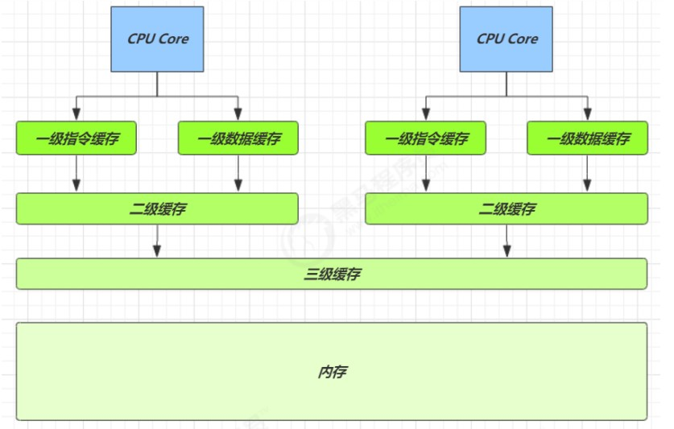
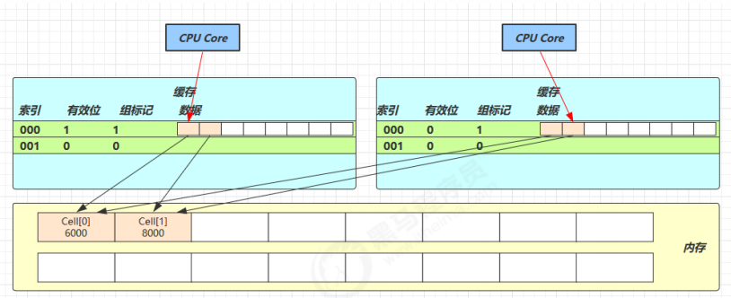
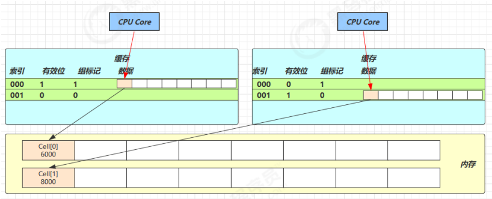
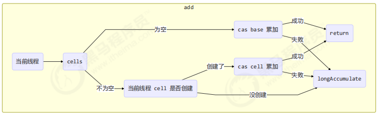

# 源码之 LongAdder
- LongAdder 是并发大师 @author Doug Lea （大哥李）的作品，设计的非常精巧
- LongAdder 类继承抽象类Striped64，它有几个关键域
## 关键域
```java
/**
 * A package-local class holding common representation and mechanics
 * for classes supporting dynamic striping on 64bit values. The class
 * extends Number so that concrete subclasses must publicly do so.
 */
@SuppressWarnings("serial")
abstract class Striped64 extends Number {
    // transient 不会把这些信息进行序列化
    // 累加单元数组, 懒惰初始化
    transient volatile Cell[] cells;
    // 基础值, 如果没有竞争, 则用 cas 累加这个域
    transient volatile long base;
    // 在 cells 创建或扩容时, 置为 1, 表示加锁，类似CAS锁，参考 {@link lin.xi.chun.concurrency.juc.atomic.accumulator.LockCas}
    transient volatile int cellsBusy;
    
    /* 先省略其他代码 */
}
```
疑问：CAS不是号称无锁的吗？有什么又会被拿来作为锁？答：因为涉及cell扩容的时候，多个线程共享cells数组，需要保证其线程安全
## Cell类
上面有个Cell数组，
```java
/**
 * Padded variant of AtomicLong supporting only raw accesses plus CAS.
 *
 * JVM intrinsics note: It would be possible to use a release-only
 * form of CAS here, if it were provided.
 */
@sun.misc.Contended static final class Cell {
    
    volatile long value;
    
    // 构造方法，给value赋初始值
    Cell(long x) { value = x; }
    
    // 最重要的方法, 用来 cas 方式进行累加, prev 表示旧值, next 表示新值
    final boolean cas(long prev, long next) {
        return UNSAFE.compareAndSwapLong(this, valueOffset, prev, next);
    }
    
    // 省略不重要代码
}
```

> @sun.misc.Contended修饰，用来防止缓存行伪共享。contented 英[kənˈtendɪd] 竞争；争夺
## 伪共享
什么叫缓存行？ 什么叫伪共享？\
我们都知道cpu会有
1. 一级指令缓存、一级数据缓存
2. 二级缓存
3. 三级缓存（共享的）
4. 内存


那cpu有内存就行了，为什么还要有缓存呢？缓存的速率更高，来看下表：
<table>
    <tr>
      <th>寄存器（属于cpu内部）</th>
      <th>大约需要的时钟周期（GHz主频越高，时钟周期就越短）</th>
    </tr>
    <tr>
      <td>寄存器（属于cpu内部）</td>
      <td>1 cycle (4GHz 的 CPU 约为0.25ns) 最快！</td>
    </tr>
    <tr>
      <td>L1</td>
      <td>3~4 cycle</td>
    </tr>
    <tr>
      <td>L2</td>
      <td>10~20 cycle</td>
    </tr>
    <tr>
      <td>L3</td>
      <td>40~45 cycle</td>
    </tr>
    <tr>
      <td>内存</td>
      <td>120~240 cycle</td>
    </tr>
</table>

因为 CPU 与 内存的速度差异很大，需要靠预读数据至缓存来提升效率。   
而缓存以缓存行为单位，每个缓存行对应着一块内存，一般是 64 byte（8 个 long）（译注：常用处理器的缓存行是64字节的，比较旧的处理器缓存行是32字节，一个Java的long类型是8字节，因此在一个缓存行中可以存8个long类型的变量。）  
缓存的加入会造成数据副本的产生，即同一份数据会缓存在不同核心的缓存行中  
CPU 要保证数据的一致性，如果某个 CPU 核心更改了数据，其它 CPU 核心（对应核数）对应的整个缓存行必须失效

Cell 是数组形式，在内存中是连续存储的，一个 Cell 为 24 字节（16 字节的对象头和 8 字节的 value），因此缓存行可以存下 2 个的 Cell 对象（仅48字节）。这样问题来了：  
- Core-0 要修改 Cell[0]
- Core-1 要修改 Cell[1]

无论谁修改成功，都会导致对方 Core 的缓存行失效，这就是伪共享（CPU多核的共享变量很容易放到一个缓存行中，但是之间修改没有太多的关联。所以每次修改，都会使之前缓存的数据失效，从而不能完全达到共享的效果。）
比如 Core-0 中 Cell[0]=6000, Cell[1]=8000 要累加Cell[0]=6001, Cell[1]=8000（core-0不动Cell[1]） ，这时会让 Core-1 的缓存行失效

@sun.misc.Contended 是java8加入用来解决防止伪共享的，它的原理是在使用此注解的对象或字段的前后各增加 128 字节大小的padding（空隙，没什么用途），  
为啥是前后各128字节呢？答：因为在不同的机器上，缓存行大小为32字节到256字节不等，目前通常为64字节。  
比如，将Cell[0]和Cell[1]不处于同一个缓存行，这样一个缓存行顶多读一个Cell对象从而让 CPU 将对象预读至缓存时占用不同的缓存行，这样，不会造成对方缓存行的失效  

## add方法
add方法流程：  

```java
public class LongAdder extends Striped64 implements Serializable {
    /**
     * Adds the given value.
     *
     * @param x the value to add
     */
    public void add(long x) {
        // as 为累加单元数组 Cell数组是懒惰创建的
        // b 为基础值
        // x 为累加值
        Cell[] as; long b, v; int m; Cell a;
    
        // 进入 if 的两个条件
        // 1. as 有值, 表示已经发生过竞争, 进入 if
        // 2. cas 给 base 累加时失败了, 表示 base 发生了竞争, 进入 if
        if ((as = cells) != null || !casBase(b = base, b + x)) {  // 对基础的域进行累加，累加成功就不会if块
            // uncontended 表示 cell 没有竞争
            boolean uncontended = true;
            if (
                // as 还没有创建
                as == null || (m = as.length - 1) < 0 ||
                // 当前线程对应的 cell 还没有
                (a = as[getProbe() & m]) == null ||
                // cas 给当前线程的 cell 累加失败 uncontended=false ( a 为当前线程的 cell )
                !(uncontended = a.cas(v = a.value, v + x))
            ) {
                // 进入 cell 数组创建、cell 创建的流程
                longAccumulate(x, null, uncontended);
            }
        }
    }
}
```
## 