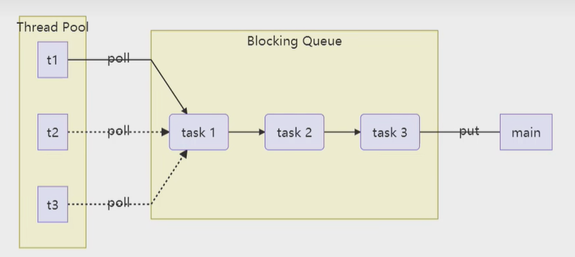
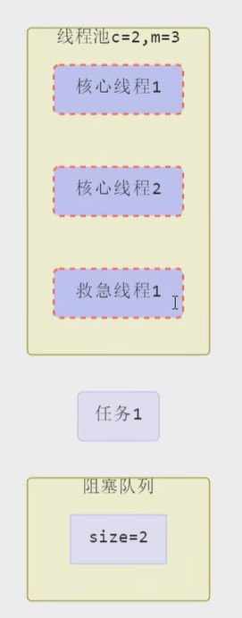
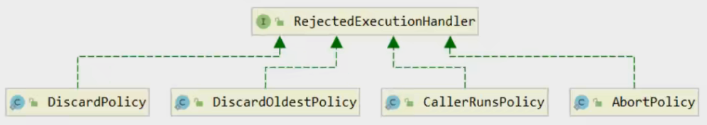

# 线程池

## 自定义线程池



手写一个自定义的线程池，有助于以后理解JDK中线程池的使用。详见[自定义线程代码](../../../../src/main/java/lin/xi/chun/concurrency/threadpool/custom/TestPool.java)

## JDK提供的线程池

### ThreadPoolExecutor


- ExecutorService：定义线程池基本的方法
- ScheduleExecutorService：扩展ExecutorService，新增任务调度功能，用来定时执行任务

#### 线程池状态

ThreadPoolExecutor 使用 int 的高 3 位来表示线程池状态，低 29 位表示线程数量（共32位）

那为什么不用两个int数，一个存储“状态”，一个存储“数量”呢？原因后面补充……

<table>
    <tr>
        <th>状态名</th>
        <th>高3位</th>
        <th>接收新任务</th>
        <th>处理阻塞队列任务</th>
        <th>说明</th>
    </tr>
    <tr>
        <td>RUNNING</td>
        <td>111</td>
        <td>Y</td>
        <td>Y</td>
        <td>当线程池对象被创建出来，初始的状态就是RUNNING</td>
    </tr>
     <tr>
        <td>SHUTDOWN</td>
        <td>000</td>
        <td>N</td>
        <td>Y</td>
        <td>当调用了线程池的shutdown()方法，意图就是要停止线程池。调用shutdown()方法的那一刻就不会接收新任务，但它相对温和，会让运行中的任务处理完，也会处理阻塞队列剩余任务</td>
    </tr>
    <tr>
        <td>STOP</td>
        <td>001</td>
        <td>N</td>
        <td>N</td>
        <td>当调用了线程池的shutdownNow()方法，会中断正在执行的任务，并抛弃阻塞队列任务。STOP相对SHUTDOWN比较暴力</td>
    </tr>
    <tr>
        <td>TIDYING</td>
        <td>010</td>
        <td>-</td>
        <td>-</td>
        <td>任务全执行完毕，活动线程为 0 即将进入终结</td>
    </tr>
    <tr>
        <td>TERMINATED</td>
        <td>011</td>
        <td>-</td>
        <td>-</td>
        <td>终结状态</td>
    </tr>
</table>

<font color="red">从数字上比较，TERMINATED > TIDYING > STOP > SHUTDOWN > RUNNING，RUNNING是“111”，为什么是最小的？这是因为最高位表示符号位，因此它是个负数。</font>
自解： 在计算机中，使用最高位作为符号位的情况下，通常使用二进制补码表示有符号整数。在这种表示方式下，最高位为0表示正数，最高位为1表示负数。
补码为"111"的二进制数在十进制中表示的值是-1

这些信息存储在一个原子变量 ctl 中，目的是将线程池状态与线程个数合二为一，这样就可以用<font color="red">一次 cas 原子操作</font>进行赋值

```java
// c 为旧值， ctlOf方法返回结果为新值(计算新的状态和新的线程数量)
ctl.compareAndSet(c, ctlOf(targetState, workerCountOf(c))));

// rs（Running States）为高 3 位代表线程池状态， wc（Worker Count）为低 29 位代表线程个数，ctl 是合并它们
// 由于两个属性值对应的不同位，所以运算中做个位或就可以了
private static int ctlOf(int rs, int wc) { return rs | wc; }
```

#### 构造方法
```java
public ThreadPoolExecutor(
        int corePoolSize,
        int maximumPoolSize,
        long keepAliveTime,
        TimeUnit unit,
        BlockingQueue<Runnable> workQueue,
        ThreadFactory threadFactory,
        RejectedExecutionHandler handler
)
```

- corePoolSize 核心线程数目 (最多保留的线程数)
- maximumPoolSize 最大线程数目（maximumPoolSize = 核心线程数corePoolSize + 救急线程数）救急线程任务执行完，没有新任务了，就会销毁掉。
- keepAliveTime 生存时间 - 针对救急线程（没活可干的时候能生存多久）
- unit 时间单位 - 针对救急线程
- workQueue 阻塞队列
- threadFactory 线程工厂 - 可以为线程创建时起个好名字。方便把线程池中的线程和其他线程区分开来
- handler 拒绝策略。当等待队列满员，最大线程数耗光（即核心线程都派上了，救急线程也都派上了），仍有新任务进来需要执行，这时候就会执行拒绝策略。



- 线程池中刚开始没有线程，当一个任务提交给线程池后，线程池会创建一个新线程来执行任务。
- 当线程数达到 corePoolSize 并没有线程空闲，这时再加入任务，新加的任务会被加入workQueue 队列排队，直到有空闲的线程。
- 如果队列选择了有界队列，那么任务超过了队列大小时，会创建 maximumPoolSize - corePoolSize 数目的线程来救急。
  <font color="red">如果用的是无界队列，就没有救急线程的概念了，都是核心线程执行完一个就去等待队列里面拿一个执行。</font>
- 如果线程到达 maximumPoolSize 仍然有新任务这时会执行拒绝策略。拒绝策略 jdk 提供了 4 种实现(接口是叫RejectedExecutionHandler)，其它著名框架也提供了实现
  - AbortPolicy 让调用者抛出 RejectedExecutionException 异常，这是默认策略
  - CallerRunsPolicy 让调用者运行任务
  - DiscardPolicy 放弃本次任务
  - DiscardOldestPolicy 放弃队列中最早的任务，本任务取而代之
  - Dubbo 的实现，在抛出 RejectedExecutionException 异常之前会记录日志，并 dump 线程栈信息，方便定位问题
  - Netty 的实现，是创建一个新线程来执行任务
  - ActiveMQ 的实现，带超时等待（60s）尝试放入队列，类似我们之前自定义的拒绝策略
  - PinPoint 的实现，它使用了一个拒绝策略链，会逐一尝试策略链中每种拒绝策略
- 当高峰过去后，超过corePoolSize 的救急线程如果一段时间没有任务做，需要结束节省资源，这个时间由keepAliveTime和unit来控制。



根据这个构造方法，JDK Executors 类中提供了众多工厂方法来创建各种用途的线程池（其实就是定好了各种参数组合）

#### newFixedThreadPool
翻译过来：创建一个固定大小的线程池
```java
public static ExecutorService newFixedThreadPool(int nThreads) {
    return new ThreadPoolExecutor(nThreads, nThreads, 
        0L, TimeUnit.MILLISECONDS,
        new LinkedBlockingQueue<Runnable>());
}
```

特点
- 核心线程数=最大线程数（没有救急线程被创建），因此也无需超时时间
- 阻塞队列是无界的，可以放任意数量的任务（自解：队列构造函数中没有指定容量大小，但其实我看无参构造，也是有容量值的，只不过是Integer.MAX_VALUE，很大了，相当于无界）

> **评价** 适用于任务量已知，相对耗时的任务

#### newCachedThreadPool
翻译过来：带缓冲功能的线程池
```java
public static ExecutorService newCachedThreadPool() {
    return new ThreadPoolExecutor(0, Integer.MAX_VALUE,
        60L, TimeUnit.SECONDS,
        new SynchronousQueue<Runnable>());
}
```

**特点**
- 核心线程数是 0， 最大线程数是 Integer.MAX_VALUE，救急线程的空闲生存时间是 60s，意味着
  - 全部都是救急线程（60s 后可以回收）
  - 救急线程可以无限创建
- 队列采用了 SynchronousQueue 实现特点是，它没有容量，没有线程来取是放不进去的（一手交钱、一手交货），可参考[代码](../../../../src/main/java/lin/xi/chun/concurrency/threadpool/TestSynchronousQueue.java)

> **评价** 整个线程池表现为线程数会根据任务量不断增长，没有上限，当任务执行完毕，空闲1分钟后释放线程。\
> 适合任务数比较密集，但每个任务执行时间较短的情况。
> 
> 自解：并不是同时只能执行一个，单个线程如果任务耗时时间长的话，还是会并发执行多个的。例如：来一个快递员取件给一个快递，那送快递的时间要是长，
> 会同时有多个快递员一起送快递的。

#### newSingleThreadExecutor
```java
public static ExecutorService newSingleThreadExecutor() {
    return new FinalizableDelegatedExecutorService(
            new ThreadPoolExecutor(1, 1, 
                0L, TimeUnit.MILLISECONDS,
                new LinkedBlockingQueue<Runnable>()));
}
```
**特点**
- 核心线程数是1， 最大线程数是1，意味着没有救急线程。
- 队列选择的也是阻塞的，没有边界的队列。

**使用场景：**

希望多个任务排队执行。线程数固定为 1，任务数多于 1 时，会放入无界队列排队。任务执行完毕，这唯一的线程也不会被释放。

1. 那和创建一个线程，执行一堆任务有什么区别呢？

- <font color="red">自己创建一个单线程串行执行任务，如果任务执行失败而终止那么没有任何补救措施，而线程池还会新建一个线程，保证池的正常工作</font>，可参考[代码](../../../../src/main/java/lin/xi/chun/concurrency/threadpool/TestSynchronousQueue.java)

2. 那和Executors.newFixedThreadPool(1) 初始值设为1有什么区别呢？

- Executors.newFixedThreadPool(1) 初始时为1，以后<font color="red">还可以修改</font>。而且new返回的是ThreadPoolExecutor对象，可以强转后调用 setCorePoolSize等方法进行修改
- 根据上一点，所以需要Executors.newSingleThreadExecutor() 线程个数始终为1，不能修改。因此它<font color="red">外面包装了FinalizableDelegatedExecutorService，应用的是装饰器模式</font>，只对外暴露了ExecutorService接口，因此不能调用ThreadPoolExecutor中特有的方法

#### 提交任务
```java
// 执行任务
void execute(Runnable command);

// 提交任务 task，用返回值 Future 获得任务执行结果
<T> Future<T> submit(Callable<T> task);

// 提交 tasks 中所有任务
<T> List<Future<T>> invokeAll(Collection<? extends Callable<T>> tasks) throws InterruptedException;

// 提交 tasks 中所有任务，带超时时间
<T> List<Future<T>> invokeAll(Collection<? extends Callable<T>> tasks, long timeout, TimeUnit unit) throws InterruptedException;

// 提交 tasks 中所有任务，哪个任务先成功执行完毕，返回此任务执行结果，其它任务取消
<T> T invokeAny(Collection<? extends Callable<T>> tasks) throws InterruptedException, ExecutionException;

// 提交 tasks 中所有任务，哪个任务先成功执行完毕，返回此任务执行结果，其它任务取消，带超时时间
<T> T invokeAny(Collection<? extends Callable<T>> tasks, long timeout, TimeUnit unit) throws InterruptedException, ExecutionException, TimeoutException;
```

Callable与Runnable相比多了返回结果。那它是怎么接收返回结果呢？其实它利用的是之前讲过“保护性暂停模式”，可参考[代码](../../../../src/main/java/lin/xi/chun/concurrency/thread/cp_pattern/synchronous/guarded_suspension/GuardedSuspensionTest1.java)

#### 关闭线程池

**shutdown**
```java
/*
  线程池状态变为 SHUTDOWN
  - 不会接收新任务
  - 但已提交任务会执行完
  - 此方法不会阻塞调用线程的执行
*/
void shutdown();
```

```java
/**
 * 主要源码
 */
public void shutdown() {
    final ReentrantLock mainLock = this.mainLock;
    mainLock.lock();
    try {
        checkShutdownAccess();
        // 修改线程池状态
        advanceRunState(SHUTDOWN);
        // 仅会打断空闲线程
        interruptIdleWorkers();
        onShutdown(); // 扩展点 ScheduledThreadPoolExecutor
    } finally {
        mainLock.unlock();
    }
    // 尝试终结(没有运行的线程可以立刻终结，如果还有运行的线程也不会等)
    tryTerminate();
}
```

**shutdownNow**

```java
/*
  线程池状态变为 STOP
  - 不会接收新任务
  - 会将等待队列中的任务返回
  - 并用 interrupt 的方式中断正在执行的任务
*/
List<Runnable> shutdownNow();
```

```java
/**
 * 主要源码
 */
public List<Runnable> shutdownNow() {
    List<Runnable> tasks;
    final ReentrantLock mainLock = this.mainLock;
    mainLock.lock();
    try {
        checkShutdownAccess();
        // 修改线程池状态
        advanceRunState(STOP);
        // 打断所有线程
        interruptWorkers();
        // 获取队列中剩余任务
        tasks = drainQueue();
    } finally {
        mainLock.unlock();
    }
    // 尝试终结
    tryTerminate();
    // 返回队列中剩余任务
    return tasks;
}
```

#### 其它方法

```java
// 不在 RUNNING 状态的线程池，此方法就返回 true
boolean isShutdown();

// 线程池状态是否是 TERMINATED，相当于线程池已经停止工作了
boolean isTerminated();

// 调用 shutdown 后，由于调用线程并不会等待所有任务运行结束，因此如果它想在线程池 TERMINATED 后做些事情，可以利用此方法等待
boolean awaitTermination(long timeout, TimeUnit unit) throws InterruptedException;
```

## 创建多少线程池合适

- 过小会导致程序不能充分地利用系统资源、容易导致饥饿
- 过大会导致更多的线程上下文切换（切换多了，也会拖累速度），过多的线程也会占用更多内存

> 网上找的定义：线程饥饿（Thread Starvation）是指在多线程编程中，某些线程由于无法获取到所需的系统资源或得不到合理的调度而无法执行的情况。

### CPU密集型运算

通常采用“cpu核数+1”能够实现最优的CPU利用率，+1 是保证当线程由于页缺失故障（操作系统）或其它原因导致暂停时，额外的这个线程就能顶上去，保证CPU时钟周期不被浪费
（常见的是做数据分析时）

### I/O密集型运算

（更常见，web应用程序就是属于I/O密集型运算）CPU 不总是处于繁忙状态，例如，当你执行业务计算时，这时候会使用 CPU 资源，但当你执行 I/O 操作时、
远程RPC调用时，包括进行数据库操作时，这时候 CPU 就闲下来了，你可以利用多线程（创建更多的线程）提高它的利用率。

经验公式如下

> 线程数 = 核数 * 期望CPU利用率 * ( 总时间(CPU计算时间+等待时间) / CPU计算时间 )

例如 4 核 CPU 计算时间是 50% ，其它等待时间是 50%，期望 cpu 被 100% 利用，套用公式

> 4 * 100% * ( 100% / 50% ) = 8

例如 4 核 CPU 计算时间是 10% ，其它等待时间是 90%，期望 cpu 被 100% 利用，套用公式

> 4 * 100% * ( 100% / 10% ) = 40

时间占比估算：通常需要用监控工具，一开始可以不用太精确，后面可以慢慢调优。

## 任务调度线程池

有的时候我们希望任务延时执行（比如过几秒后再执行），还有的时候我们希望任务反复地被执行（比如每隔几秒执行一次），这时候就需要『任务调度线程池』

在『任务调度线程池』功能（jdk 1.5）加入之前，（jdk 1.3）可以使用 java.util.Timer 来实现定时功能，Timer 的优点在于简单易用，
<font color="red">但由于所有任务都是由同一个线程来调度， 因此所有任务都是串行执行的，同一时间只能有一个任务在执行，前一个任务的延迟或异常都将会影响到之后的任务。</font>
(例如第一个任务出现异常没有被正确捕获处理)

先来看下Timer的基本使用[示例](../../../../src/main/java/lin/xi/chun/concurrency/threadpool/TestTimer.java)，
知道了它的缺点之后，使用ScheduledExecutorService改写[示例](../../../../src/main/java/lin/xi/chun/concurrency/threadpool/TestScheduleThreadPool.java)

另外，再演示一个“如何让每周四 18:00:00 定时执行任务？”的[示例](../../../../src/main/java/lin/xi/chun/concurrency/threadpool/TestScheduleApply.java)
