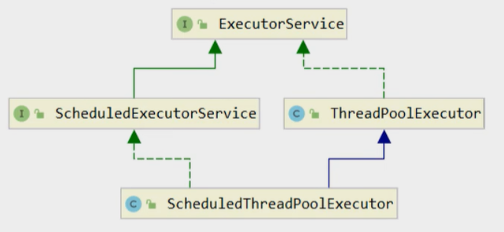

# 自定义线程池

## 自定义线程池


手写一个自定义的线程池，有助于以后理解JDK中线程池的使用。详见[自定义线程代码](../../../../src/main/java/lin/xi/chun/concurrency/threadpool/custom/TestPool.java)

## JDK提供的线程池

### ThreadPoolExecutor



- ExecutorService：定义线程池基本的方法
- ScheduleExecutorService：扩展ExecutorService，新增任务调度功能，用来定时执行任务

#### 线程池状态

ThreadPoolExecutor 使用 int 的高 3 位来表示线程池状态，低 29 位表示线程数量（共32位）

那为什么不用两个int数，一个存储“状态”，一个存储“数量”呢？原因后面补充……

<table>
    <tr>
        <th>状态名</th>
        <th>高3位</th>
        <th>接收新任务</th>
        <th>处理阻塞队列任务</th>
        <th>说明</th>
    </tr>
    <tr>
        <td>RUNNING</td>
        <td>111</td>
        <td>Y</td>
        <td>Y</td>
        <td>当线程池对象被创建出来，初始的状态就是RUNNING</td>
    </tr>
     <tr>
        <td>SHUTDOWN</td>
        <td>000</td>
        <td>N</td>
        <td>Y</td>
        <td>当调用了线程池的shutdown()方法，意图就是要停止线程池。调用shutdown()方法的那一刻就不会接收新任务，但它相对温和，会让运行中的任务处理完，也会处理阻塞队列剩余任务</td>
    </tr>
    <tr>
        <td>STOP</td>
        <td>001</td>
        <td>N</td>
        <td>N</td>
        <td>当调用了线程池的shutdownNow()方法，会中断正在执行的任务，并抛弃阻塞队列任务。STOP相对SHUTDOWN比较暴力</td>
    </tr>
    <tr>
        <td>TIDYING</td>
        <td>010</td>
        <td>-</td>
        <td>-</td>
        <td>任务全执行完毕，活动线程为 0 即将进入终结</td>
    </tr>
    <tr>
        <td>TERMINATED</td>
        <td>011</td>
        <td>-</td>
        <td>-</td>
        <td>终结状态</td>
    </tr>
</table>

<font color="red">从数字上比较，TERMINATED > TIDYING > STOP > SHUTDOWN > RUNNING，RUNNING是“111”，为什么是最小的？这是因为最高位表示符号位，因此它是个负数。</font>
自解： 在计算机中，使用最高位作为符号位的情况下，通常使用二进制补码表示有符号整数。在这种表示方式下，最高位为0表示正数，最高位为1表示负数。
补码为"111"的二进制数在十进制中表示的值是-1

这些信息存储在一个原子变量 ctl 中，目的是将线程池状态与线程个数合二为一，这样就可以用<font color="red">一次 cas 原子操作</font>进行赋值

```java
// c 为旧值， ctlOf方法返回结果为新值(计算新的状态和新的线程数量)
ctl.compareAndSet(c, ctlOf(targetState, workerCountOf(c))));

// rs（Running States）为高 3 位代表线程池状态， wc（Worker Count）为低 29 位代表线程个数，ctl 是合并它们
// 由于两个属性值对应的不同位，所以运算中做个位或就可以了
private static int ctlOf(int rs, int wc) { return rs | wc; }
```

#### 构造方法
```java
public ThreadPoolExecutor(
        int corePoolSize,
        int maximumPoolSize,
        long keepAliveTime,
        TimeUnit unit,
        BlockingQueue<Runnable> workQueue,
        ThreadFactory threadFactory,
        RejectedExecutionHandler handler
)
```

- corePoolSize 核心线程数目 (最多保留的线程数)
- maximumPoolSize 最大线程数目（maximumPoolSize = 核心线程数corePoolSize + 救急线程数）救急线程任务执行完，没有新任务了，就会销毁掉。
- keepAliveTime 生存时间 - 针对救急线程（没活可干的时候能生存多久）
- unit 时间单位 - 针对救急线程
- workQueue 阻塞队列
- threadFactory 线程工厂 - 可以为线程创建时起个好名字。方便把线程池中的线程和其他线程区分开来
- handler 拒绝策略。当等待队列满员，最大线程数耗光（即核心线程都派上了，救急线程也都派上了），仍有新任务进来需要执行，这时候就会执行拒绝策略。


- 线程池中刚开始没有线程，当一个任务提交给线程池后，线程池会创建一个新线程来执行任务。
- 当线程数达到 corePoolSize 并没有线程空闲，这时再加入任务，新加的任务会被加入workQueue 队列排队，直到有空闲的线程。
- 如果队列选择了有界队列，那么任务超过了队列大小时，会创建 maximumPoolSize - corePoolSize 数目的线程来救急。
  <font color="red">如果用的是无界队列，就没有救急线程的概念了，都是核心线程执行完一个就去等待队列里面拿一个执行。</font>
- 如果线程到达 maximumPoolSize 仍然有新任务这时会执行拒绝策略。拒绝策略 jdk 提供了 4 种实现(接口是叫RejectedExecutionHandler)，其它著名框架也提供了实现
  - AbortPolicy 让调用者抛出 RejectedExecutionException 异常，这是默认策略
  - CallerRunsPolicy 让调用者运行任务
  - DiscardPolicy 放弃本次任务
  - DiscardOldestPolicy 放弃队列中最早的任务，本任务取而代之
  - Dubbo 的实现，在抛出 RejectedExecutionException 异常之前会记录日志，并 dump 线程栈信息，方便定位问题
  - Netty 的实现，是创建一个新线程来执行任务
  - ActiveMQ 的实现，带超时等待（60s）尝试放入队列，类似我们之前自定义的拒绝策略
  - PinPoint 的实现，它使用了一个拒绝策略链，会逐一尝试策略链中每种拒绝策略
- 当高峰过去后，超过corePoolSize 的救急线程如果一段时间没有任务做，需要结束节省资源，这个时间由keepAliveTime和unit来控制。


根据这个构造方法，JDK Executors 类中提供了众多工厂方法来创建各种用途的线程池（其实就是定好了各种参数组合）