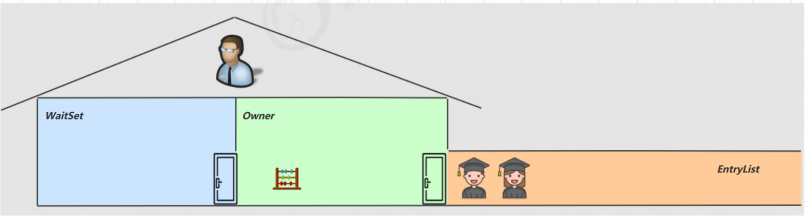

# Synchronized以及相关方法介绍
语法
```
synchronized(对象) // 线程1， 线程2(blocked)
{
 临界区
}
```
使用示例：一个线程进行++5000次，一个线程进行--5000次，最后保证结果为0
```java
public class SyncTest{
    static int counter = 0;
    static final Object room = new Object();
    public static void main(String[] args) throws InterruptedException {
        Thread t1 = new Thread(() -> {
            for (int i = 0; i < 5000; i++) {
                synchronized (room) {
                    counter++;
                }
            }
        }, "t1");
        Thread t2 = new Thread(() -> {
            for (int i = 0; i < 5000; i++) {
                synchronized (room) {
                    counter--;
                }
            }
        }, "t2");
        t1.start();
        t2.start();
        t1.join();
        t2.join();
        log.debug("{}",counter);
    }
}
```

- synchronized(对象) 中的对象，可以想象为一个房间（room），有唯一入口（门）房间只能一次进入一人进行计算，线程 t1，t2 想象成两个人
- 当线程 t1 执行到 synchronized(room) 时就好比 t1 进入了这个房间，并锁住了门拿走了钥匙，在门内执行count++ 代码
- 这时候如果 t2 也运行到了 synchronized(room) 时，它发现门被锁住了，只能在门外等待，发生了上下文切换，阻塞住了
- 这中间即使 t1 的 cpu 时间片不幸用完，被踢出了门外（不要错误理解为锁住了对象就能一直执行下去哦），这时门还是锁住的，t1 仍拿着钥匙，t2 线程还在阻塞状态进不来，只有下次轮到 t1 自己再次获得时间片时才能开门进入
- 当 t1 执行完 synchronized{} 块内的代码，这时候才会从 obj 房间出来并解开门上的锁，唤醒 t2 线程把钥匙给他。t2 线程这时才可以进入 obj 房间，锁住了门拿上钥匙，执行它的 count-- 代码